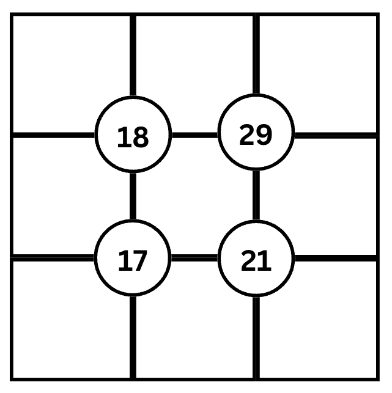
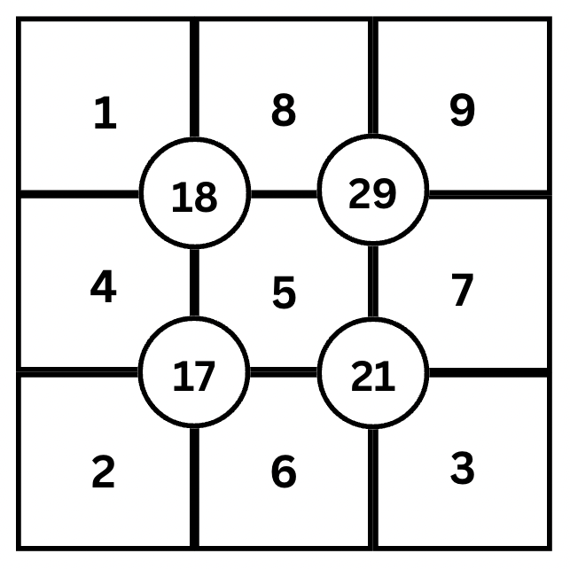

# SqGrid

[](https://pypi.org/project/sqgrid)
[](https://pypi.org/project/sqgrid)

-----

**Table of Contents**

- [Installation](#installation)
- [License](#license)

## Description

This is a puzzle solving program. The puzzle is a 3x3 grid of empty boxes, with another box at each of the interior vertices. Each box at each vertex contains a number.



The puzzle is to fill in the empty boxes with the numbers 1-9 so that the numbers surrounding each vertex add up to the number in the vertex box.


=======
## Algorithm

## Solution mechanism

The first step in solving the puzzle is to reduce the possible number of guesses making a list of every possible combination of addends for each of the vertex sums. This reduces the number of both possible solutions and guesses that need to be made which allows the program to run in a more organized fashion than a brute force approach and it allows the program to scale up to bigger puzzle sizes.

After the combos are determined for each vertex sum, the are tried in different order to search for a group of addend combinations that solves the puzzle.

One note, there are actually many solutions to each puzzle.


## Installation

```console
pip install sqgrid
```

## License

`sqgrid` is distributed under the terms of the [MIT](https://spdx.org/licenses/MIT.html) license.
